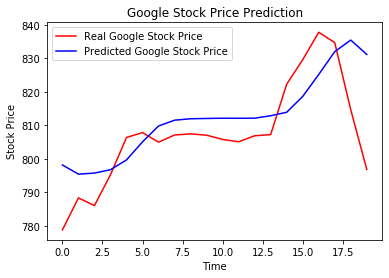

<h1>Google Stock Price Trend Predictor</h1>
<h3>Deep Learning (Recurrent Neural Network)</h3>

<pre>
--> This deep learning model tries to predict the trend in the stock price of Google.
--> Obviously we cannot predict the exact stock price, however accurate we make
    our model to be, otherwise everybody would become billionares. According to the
    Brownian motion mathematical theory, next stock price is completely independent
    from the previous stock price.
--> We will just try to predict the upward and downward trend in the stock price,
    using a Recurrent Neural Network (RNN). So, this is the financial aspect of
    engineering.
--> Long-Short Term Memory (LSTM) layers have been used to setup the architecture.
    The RNN has been trained on 5 years of financial data (open Stock price) of Google,
    2012 - 2016. That training data is in the file 'Google_Stock_Price_Train.csv'.
    Based on that we have predicted the stock price of January 2017. Note that a
    week has only five financial days (Monday to Friday).
--> Final we have plotted a graph between the predicted data and actual data as
    available in the file 'Google_Stock_Price_Test.csv'.

Major Python Libraries used -
    * numpy, matplotlib, pandas
    * keras (TensorFlow Backend)
    * Skicit Learn
IDE used -
    * Spyder 3.3
    * Jupyter Notebook
</pre>

 

 

<pre>
--> The red curve in the above graph is the actual stock price for the month of January 2017
    and the blue curve is the predicted stock price
--> And as we can see our model predicted the trend in stock price and therefore shape is somewhat
    similar but our RNN was unable to predict the steep changes and that is perfectly acceptable.
</pre>
